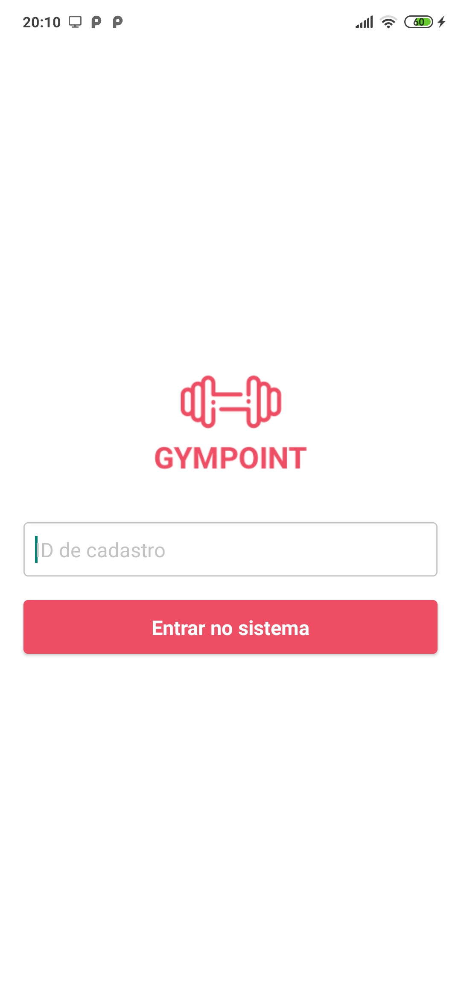
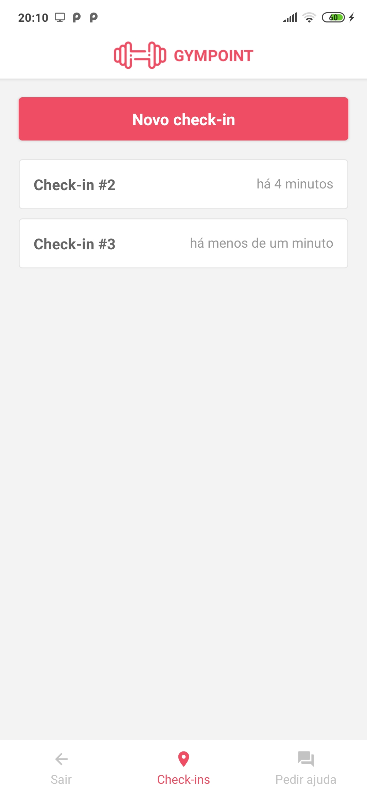
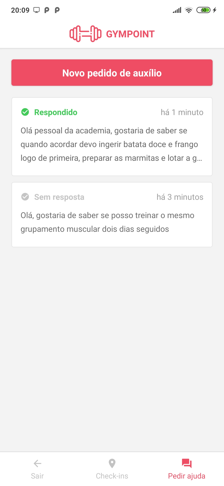
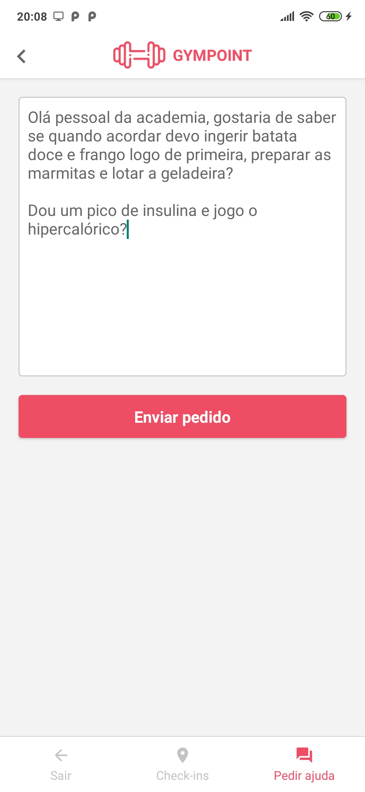

# Gympoint - APP for customers

    

## Features

- Login with student ID
- Check-in
- Issue an help order
- Follow the answers for help orders

## Try it out

You can install the app on your device to test it out:

1. [Install with Expo](https://exp.host/@caioquirino/gympoint)
2. [Download the apk](https://exp-shell-app-assets.s3.us-west-1.amazonaws.com/android/%40caioquirino/gympoint-5666a28719f6430d8c8c3ce56d01d599-signed.apk)

## Relevant libraries

- [expo](https://docs.expo.io/versions/latest/)
- [axios](https://github.com/axios/axios) (api calls)
- [date-fns](https://github.com/date-fns/date-fns) (format dates)
- [react-native-root-toast](https://github.com/magicismight/react-native-root-toast) (for toast messages)
- [react-navigation](https://github.com/react-navigation/react-navigation)
- [react-redux](https://github.com/reduxjs/react-redux)
- [redux-saga](https://github.com/redux-saga/redux-saga/) (asynchronous api calls from actions)
- [redux-persist](https://github.com/rt2zz/redux-persist) (persist authentication)
- [styled-components](https://github.com/styled-components) (all styles with css)

## :arrow_down: Installing

**Clone the repo and enter the app folder**

```shell
git clone https://github.com/CaioQuirinoMedeiros/Gympoint.git

cd Gympoint/gympoint_app
```

**Install expo-cli**

```shell
npm i -g expo-cli
```

[reference to expo official documentation](https://docs.expo.io/versions/v36.0.0/get-started/installation)

**Install dependencies**

```shell
expo install
```

**Set the API_URL on `src/config/api-config`**

**Run the app**

```shell
expo start
```
