# Gympoint - WEBAPP for manager

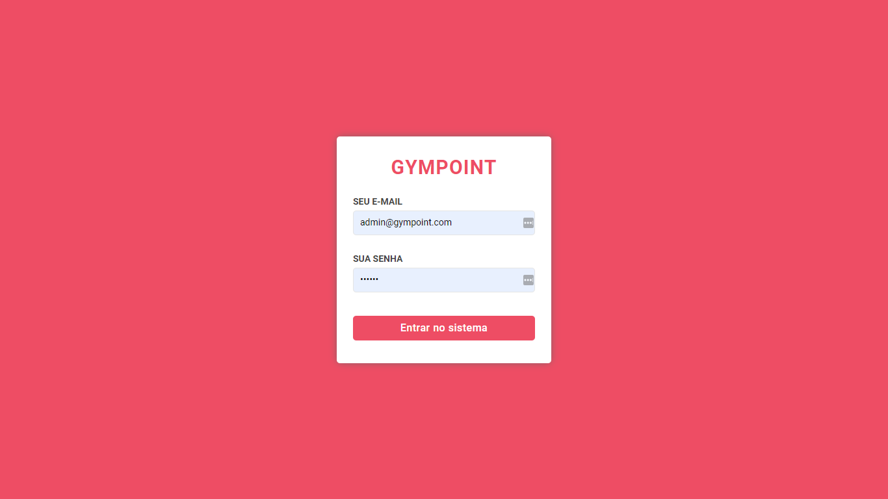
<br />
<br />
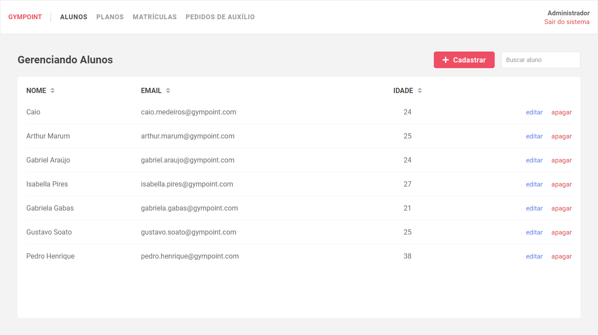
<br />
<br />

[More screenshots](#screenshots)

## Features

- Login with manager credentials
- Students CRUD
- Plans CRUD
- Enrollments CRUD
- List and answer Help Orders

## Try it out

It's deployed on netlify, check it out:

- [gympoint.com](https://gympoint.netlify.com)
  - email: `admin@gympoint.com`
  - password: `123456`

## Relevant libraries

- [formik](https://github.com/jaredpalmer/formik) (to handle all the forms)
- [yup](https://github.com/jquense/yup) (to validate forms)
- [axios](https://github.com/axios/axios) (api calls)
- [date-fns](https://github.com/date-fns/date-fns) (format dates)
- [react-router-dom](https://github.com/ReactTraining/react-router)
- [react-currency-input](https://github.com/jsillitoe/react-currency-input) (currency mask)
- [react-datepicker](https://github.com/Hacker0x01/react-datepicker/) (a great date input)
- [react-select](https://github.com/JedWatson/react-select) (a great select input)
- [react-table](https://github.com/tannerlinsley/react-table)
- [react-toastify](https://github.com/fkhadra/react-toastify) (for toast messages)
- [react-redux](https://github.com/reduxjs/react-redux)
- [redux-saga](https://github.com/redux-saga/redux-saga/) (asynchronous api calls from actions)
- [redux-persist](https://github.com/rt2zz/redux-persist) (persist authentication)
- [styled-components](https://github.com/styled-components) (all styles with css)

## :arrow_down: Installing

**Clone the repo and enter the app folder**

```shell
git clone https://github.com/CaioQuirinoMedeiros/Gympoint.git

cd Gympoint/gympoint_web
```

**Install dependencies**

```shell
yarn install
```

**Configure the API server and set the API_URL environment variable on `.env` file**

```
REACT_APP_API_URL=http://localhost:3333
```

**Run it**

```shell
yarn start
```

## Screenshots

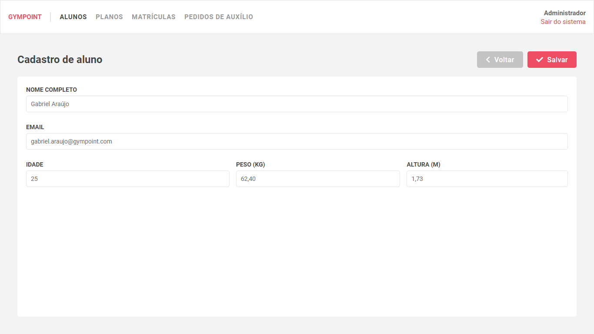<br /><br />
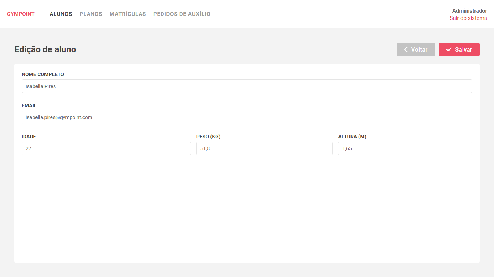<br /><br />
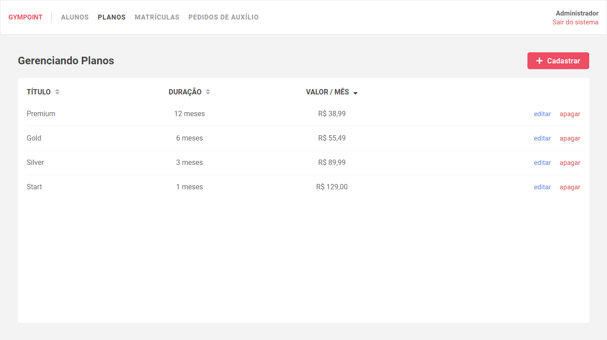<br /><br />
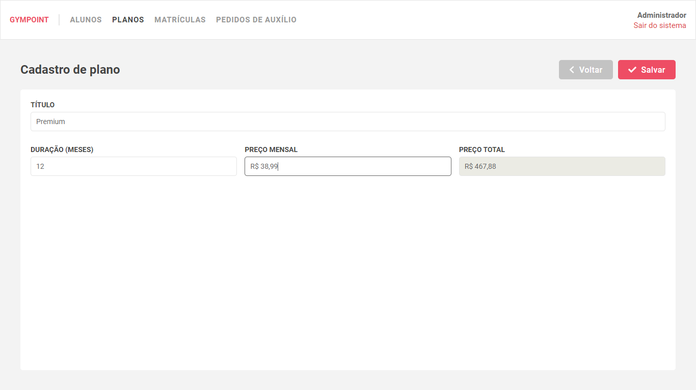<br /><br />
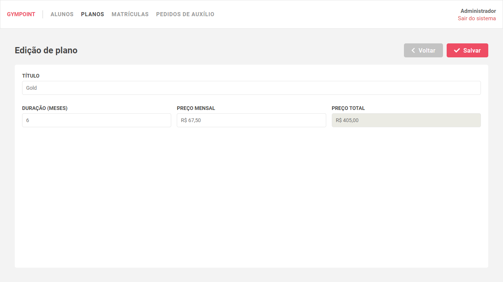<br /><br />
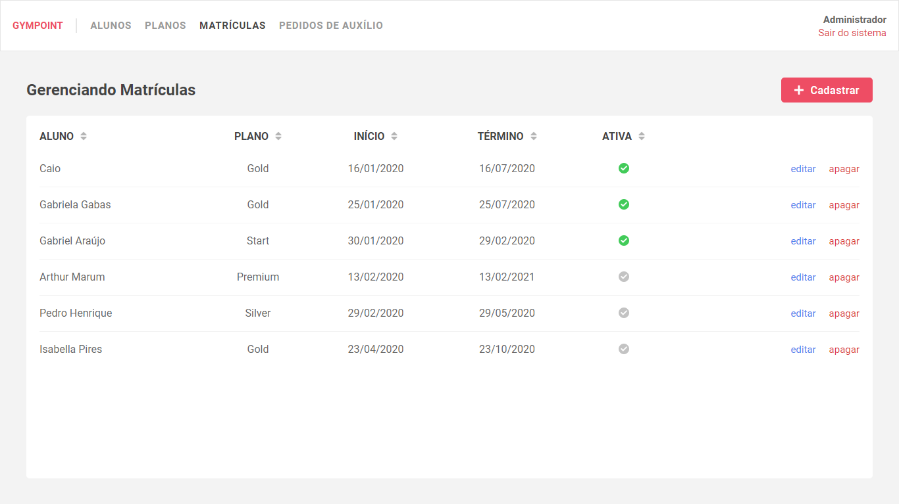<br /><br />
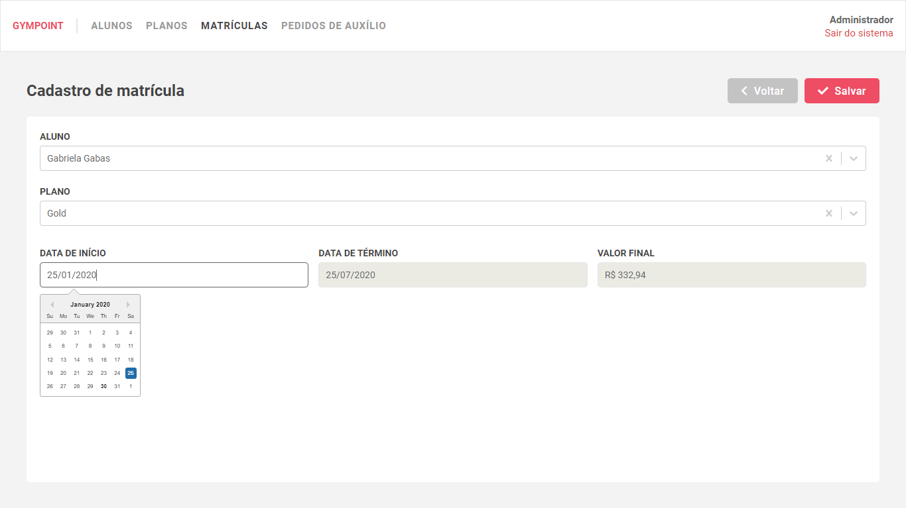<br /><br />
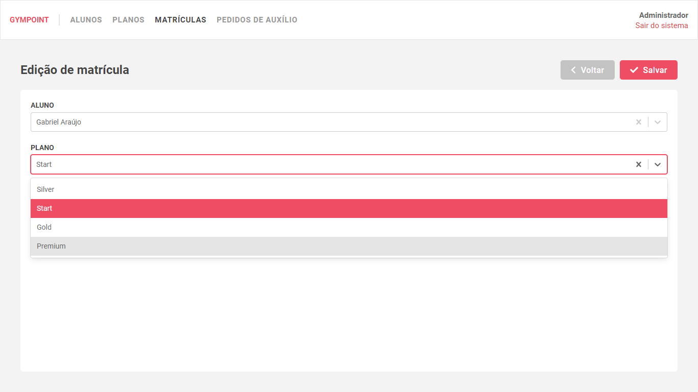<br /><br />
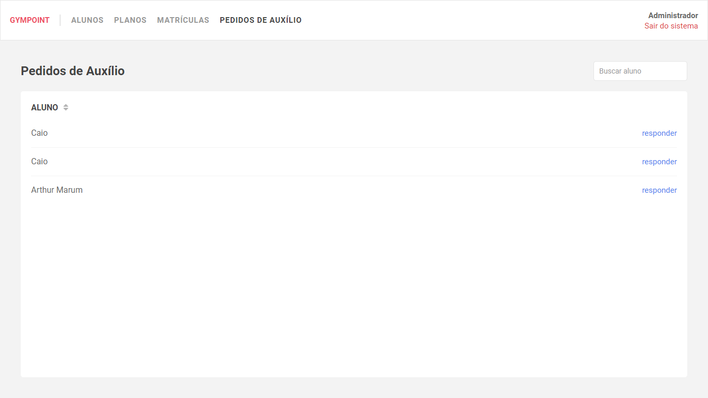<br /><br />
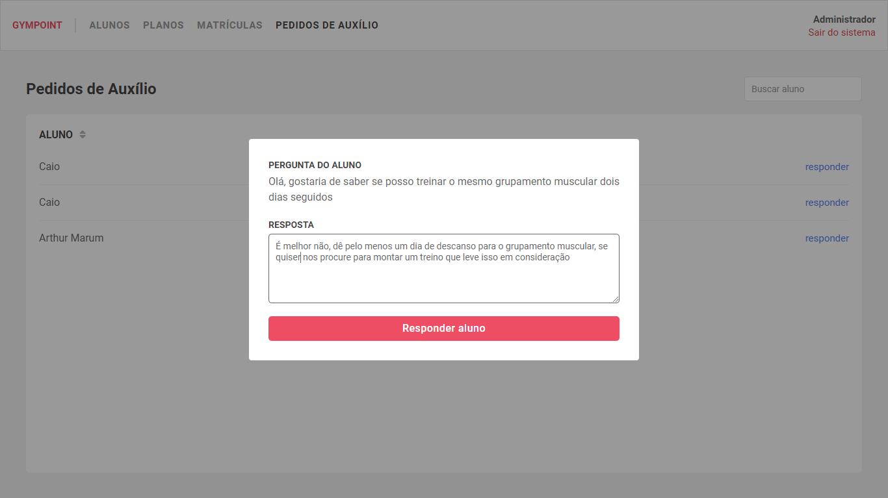<br /><br />

[](https://app.netlify.com/sites/gympoint/deploys)
